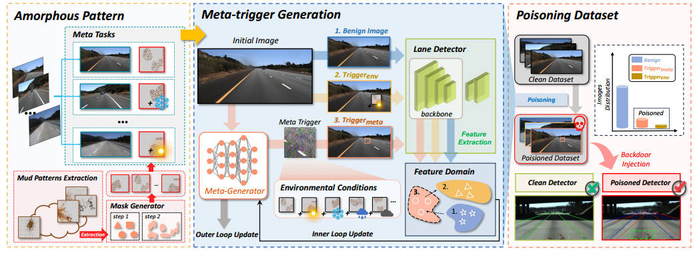

# Towards Robust Physical-world Backdoor Attacks on Lane Detection

## Introduction

This repository is the official PyTorch implemetation of paper "Towards Robust Physical-world Backdoor Attacks on Lane Detection".



## Install

### Requirements

* Python ==3.8.18

* PyTorch ==2.1.2

```shell
pip install -r requirements.txt
```

#### Data Preparation

It's necessary to prepare the dataset for the lane detection task to be poisoned, currently our project supports two types of datasets: [TuSimple](https://github.com/TuSimple/tusimple-benchmark/tree/master/doc/lane_detection) and [CULane](https://xingangpan.github.io/projects/CULane.html).

##### TuSimple 

The data should look like this:

```
dataset_root
|-- train_set
	|……
|-- test_set
	|……
|-- test_label.json
```

##### CULane

The data should look like this:

```
dataset_root
|-- driver_23_30frame
	|……
|-- driver_37_30frame
	|……
|……
```

#### Clean Lane Detection Model Preparation

Prepare the pre-trained clean lane detection model to serve as the teacher model. You can get or train them from: [LaneATT](https://github.com/lucastabelini/LaneATT), [UFLD](https://github.com/cfzd/Ultra-Fast-Lane-Detection-v2), [PolyLaneNet](https://github.com/lucastabelini/PolyLaneNet), [RESA](https://github.com/ZJULearning/resa/tree/main).

You can place it in the `model_weights` folder.

## Usage

### Generate meta-tasks using amorphous pattern

Taking the TuSimple dataset and LaneATT model as examples.

```shell
cd scripts

# edit tusimple_gendata.sh, replace the content in {}
###
cd ../data
python data_prehandle.py \
  --mode train \
  --dataset tusimple \
  --dataroot {your tusimple train dataset path} \
  --task_num 10 \
  --config_path ../models/laneatt/laneatt_tusimple_resnet34.yml \
  --checkpoint_path {your clean LD model checkpoint path} \
  --shuffle \
  --attack_method pgd --batch_size 64 \
  --model laneatt --eps 0.2 --view
###

# run
sh tusimple_gendata.sh
```

The output will be saved in `data/laneatt/xxx` 

### Pretrain the meta-generator

Before meta-training, we need to pre-train the generator using the obtained meta-tasks.

```shell
cd scripts

# edit tusimple_pretrain.sh, replace the content in {}

# run
sh tusimple_pretrain.sh
```

### Meta-training

Using the pre-trained meta-generator and meta-tasks, we can start the meta-training.

```shell
cd scripts

# edit tusimple_metatrain.sh, replace the content in {}

# run
sh tusimple_metatrain.sh
```

### Generate poisoned train dataset

After that, we can choose a **poisoning rate** and take out a portion from the clean dataset, using the trained meta-generator to construct a poisoned training dataset. At the same time, modify the poisoned lane line label files according to the specified **attack strategy**. By replacing this portion of data in the clean dataset, we can obtain the complete poisoned dataset.

```shell
cd gen_poisoned_dataset

# edit tusimple_gendata.sh, replace the content in {}
###
p=0.1
meta_p=0.7
strategy='loa'
loa_offset=60
lra_angle=4.5
# clean tusimple label path
from_path='tusimple_clean'
# save path
to_path='tusimple_loa_poisoned'
dataset_path='{your tusimple dataset path}'
generator_path='{your meta-generator path}'
python gen.py --p=${p} \
  --meta_p=${meta_p} --strategy=${strategy} \
  --loa_offset=${loa_offset} --lra_angle=${lra_angle} --from_path=${from_path} \
  --to_path=${to_path} --dataset_path=${dataset_path} --generator_path=${generator_path}
###

# run
sh gen.sh
```

#### Parameter Description

**p**: poisoning rate

**meta_p**: the proportion of meta triggers in malicious samples

**strategy**: attack strategy ['lda', 'lsa', 'loa', 'lra']

**loa_offset**: attack parameter for loa

**lra_angle**: attack parameter for lra

**from_path**: clean tusimple label path

**to_path**: poisoned train dataset save path

